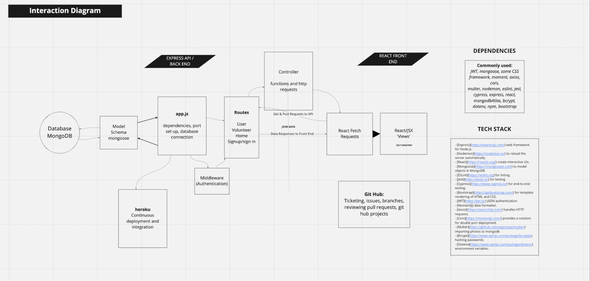
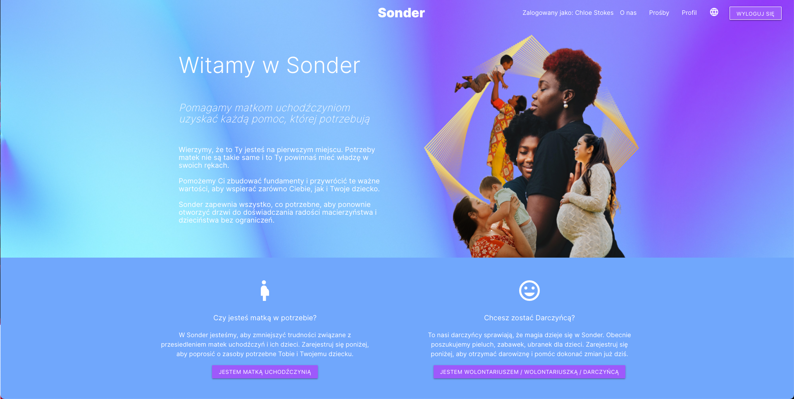

# Sonder
> *We help refugee mothers access all the help they need.*

**Sonder is a web app designed to provide all the necessities to refugee mothers, to reopen the door back to experiencing the joys of motherhood and childhood, without any limitations.**

Sonder is the two-week project of six Makers Academy students from the January 2022 cohort: Chloë, Jaroslaw, Eddie, Chris, Dash and Francesco. We all share the same passion of wanting to build something that does good.

Some of us are personally impacted by the current international events, and all of us are deeply invested in the refugee crisis.

While there are many charities helping refugees, we couldn't find a specific platform dedicated to helping refugee mothers and pregnant women.

The term Sonder describes the sudden realisation that everyone has a story, and that each random passerby is living a life as vivid and complex as everyone else. We are all living connected stories. These values of communion and empathy are at the core of Sonder.

<br>

-----
<br>

## What you can do with Sonder

* On Sonder, refugee mothers can log into their personal area, and submit a request of help by picking items from different categories.

*  The request is then available on the platform.

* Donors and volunteers can honour a request, and by doing so the mother in need is notified via email.

* The website is fully translated in seven languages, including Ukrainian, to make it as accessible as possible. It also uses icons and images where possible, for the same reason.

<br>

-----
<br>

## Set up your project

1. Fork this repository
2. Clone your forked repository to your local machine
3. Install ```Node.js```: please visit ```nodejs.org``` for the latest version
4. Navigate to server directory and run:
```
npm install
```
5. Navigate to client directory and run:
```
npm install
``` 
6. Connect to a new MongoDB Atlas database.  Any MongoDB database would be suffice although MongoDB Atlas is recommended.
   Please go to the MongoDB Atlas website and create an account for easy installation.  
   Establish the connection in the 'App.js' file in the server directory.
7. Navigate to the server directory and run:
```
npm start
```
8. At the same time in a seperate terminal navigate to the client directory and run:
```
npm start
``` 

*  Alternatively please visit the live website on Heroku: https://sonder-techforgood.herokuapp.com/
* The website is best viewed at 1920 x 1080 resolution (or equivalent) due to a bug we have no been able to fix yet.

<br>

-----
<br>

## Tech Stack
- [Express](https://expressjs.com/) web framework for Node.js.
- [Nodemon](https://nodemon.io/) to reload the server automatically.
- [React](https://reactjs.org/) create interactive UIs.
- [Mongoose](https://mongoosejs.com) to model objects in MongoDB.
- [ESLint](https://eslint.org) for linting.
- [Jest](https://jestjs.io/) for testing.
- [Cypress](https://www.cypress.io/) for end-to-end testing.
- [Materialize.css](https://materializecss.com/) for template rendering of HTML and CSS.
- [JWT](https://jwt.io/) JSON authentication.
- [Cors](https://momentjs.com/) provides a solution for double port deployment
- [Bcrypt](https://www.npmjs.com/package/bcryptjs) hashing passwords.
- [Dotenv](https://www.npmjs.com/package/dotenv/) environment variables.

<br>

-----
<br>

## Sonder MVP
- Refugee: Sign up
- Refugee: Sign in
- Refugee Sign out
- Refugee: Requests

<br>

## MVP User Stories

<details><summary>Show list</summary>

~~~~~~
As a refugee mother
In order to have access to the application
I would like to be able to sign up

As a refugee mother
So that I could access my account
I would like to be able to sign in

As a refugee mother
So that I could keep my account secure
I would like to be able to sign out

As a refugee mother
So that I could request resources
I would like to be able to post my requested items
~~~~~~

</details>

<br>

-----
<br>

## Extra User Stories: Round 1

<details><summary>Show list</summary>

~~~~~~
As a User
So that I can specify who I am
I want to be able to select either 'Refugee' or 'Donor'

As a Refugee
So that I can connect with donor in my area
I want to sign up with my city and bio

As a Donor
In order to have access to the application
I would like to be able to sign up 

As a Donor
So that I could access my account
I would like to be able to sign in

As a User
So that I can display my details
I would like to create a profile and view this
~~~~~~

</details>
<br>

## Extra User Stories: Round 2

<details><summary>Show list</summary>

~~~~~~~

As a Refugee Mother
So that I can manage my requests
I would like to see my requests and their status

As a Refugee Mother
So that I can manage my requests
I would like to accept donations

As a Refugee Mother
So that I can manage my requests
I would like to replicate my fulfiled requests

As a Refugee Mother
So I know when a Donor has offered to fulfil my request
I would like to see the requests as fulfiled

As a Refugee Mother
So I know when a Donor has offered to fulfil my request
I would like to get an email notification of a fulfiled request

As a user
So I could provide feedback to the website's creators
I would like to be able to contact them by email

As a Donor
So that I know what requests are outstanding
I would like to be able to see the outstanding requests

As a user
So that I could interact with the website
I would like the text, fields, and buttons to be in my native language

As a Refugee Mother
So that I could interact with the website
I would like to have visual representations to aid me in the use of the website's functions

As a Donor
So that I have additional information about the Refugee Mother I am interested in helping
I would like to see her profile page with bio

~~~~~~~

</details>

<br>

-----
<br>

## Diagram of the Application's Framework




<br>

-----
<br>

## Screenshots of the Live Website


<br>

-----
<br>

## Screenshot of the Live Website Translated to Polish


